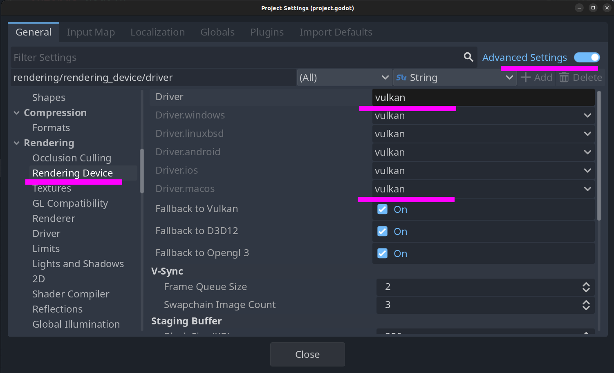

## godot-webview demo

1. Download this repository
2. Extract the [godot-webview addon](https://godotwebview.com/pages/downloads/) into the root of the project.
3. Open the project in Godot 4.4-dev7
4. Run the project, use WASD to move around, right mouse click to look

## Mac OS: Metal

important: this project is configured to use Vulkan. On Mac OS, only the 
Metal renderer is available. Switch to the Metal renderer 
`Project -> Project Settings`.



## Keyboard events

#### Method 1

Enable "Capture keys" in the WebView properties.

#### Method 2

Do it programmatically:

```
$WebView.capture_keys = true
```

Which will automatically scan/submit keys.

## Documentation

For more information, checkout the [website](https://github.com/kroketio/godot-webview-demo)

For help or feedback, reach out via:
- [Discord](https://discord.gg/jjuyfgbE7m)
- [Github issue tracker](https://github.com/kroketio/godot-webview-meta/issues)
